### 操作方法
#### タイトル
- 画面上のブロックに手をしばらくかざすと、ゲームが始まります。

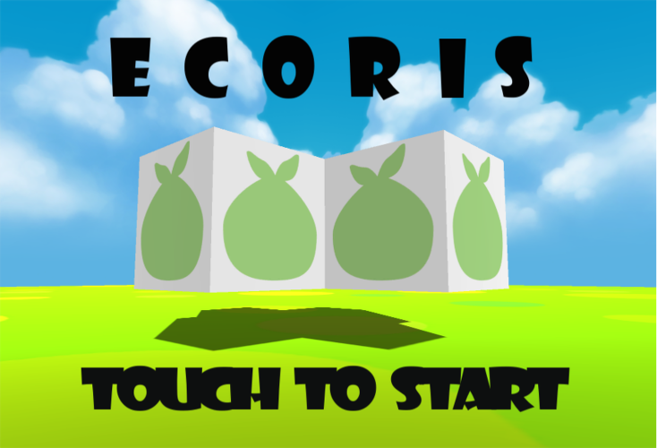

#### ブロックの移動
- ブロックは手をかざしている方向に向かって動き続けます
- 手を握ると移動が止まります

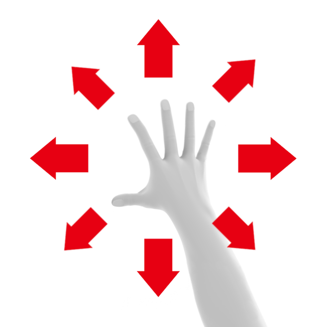
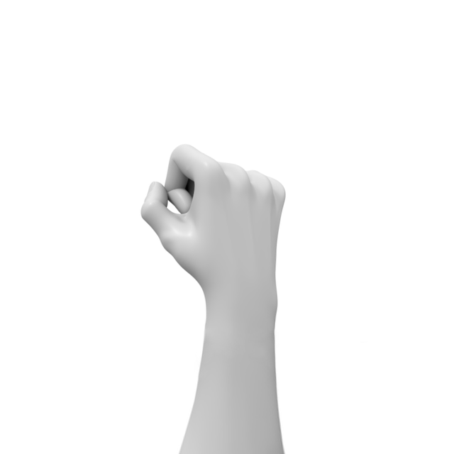

#### ブロックの回転
- 回転の軸ごとに三種類があります

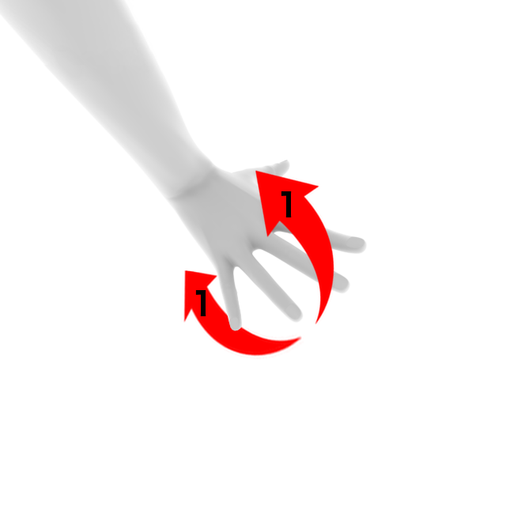
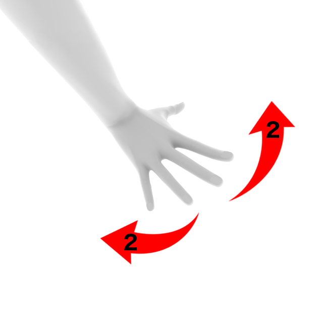
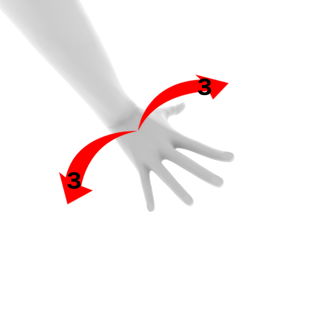

#### ブロックをつぶす
- 缶ブロックにのみ行えます
- 左右から手を叩くように近づけるとブロックを圧縮できます

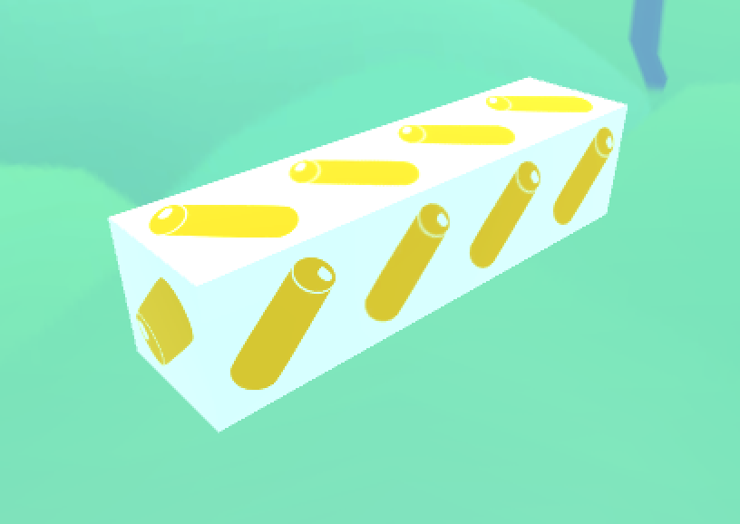
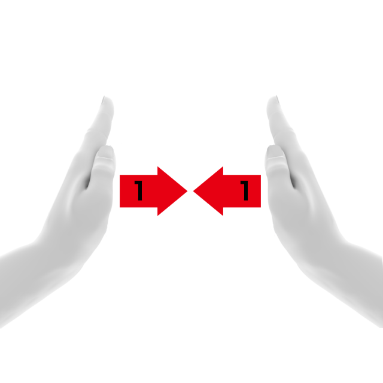

#### 水を切る（振る）
- 生ごみブロックにのみ行えます
- 両手を同時に振り下ろすことでブロックを圧縮できます

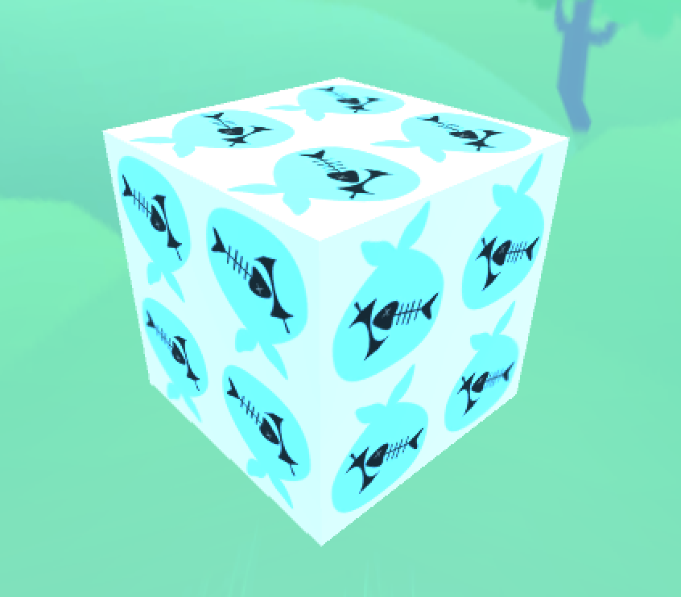
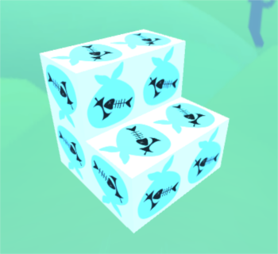
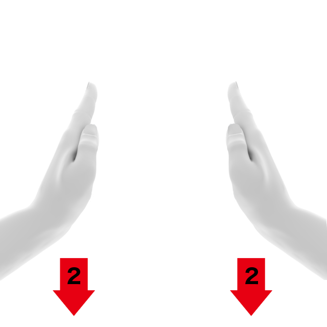

#### ブロックの落下
- 落下させたい位置で手を握り、垂直に下ろすようにします

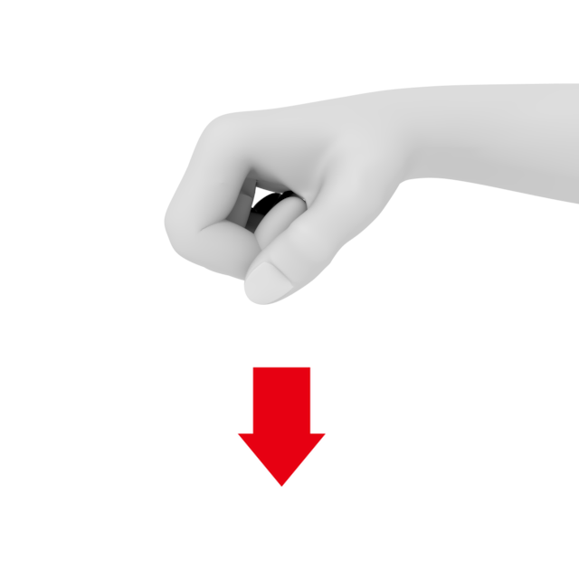

#### 視点の変更
- 手を前後に開き、目的の位置までその状態を維持します
- 距離を大きくしていく必要はありません
- どちらの手が前にあるかによって回転の方向が変化します

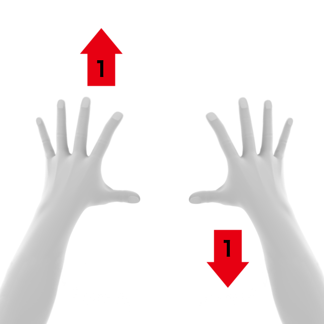
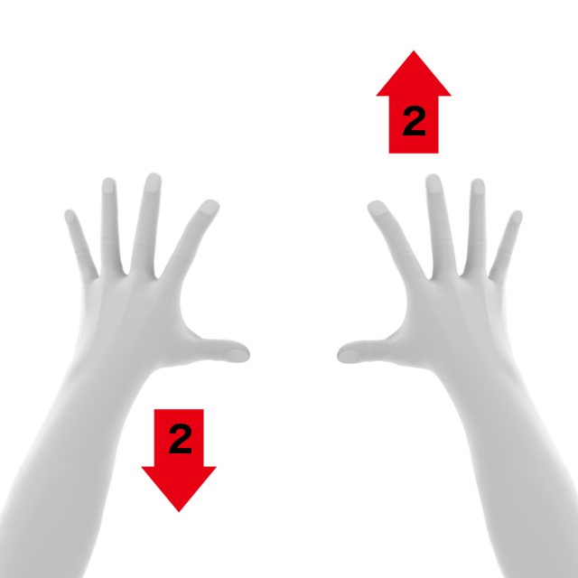
